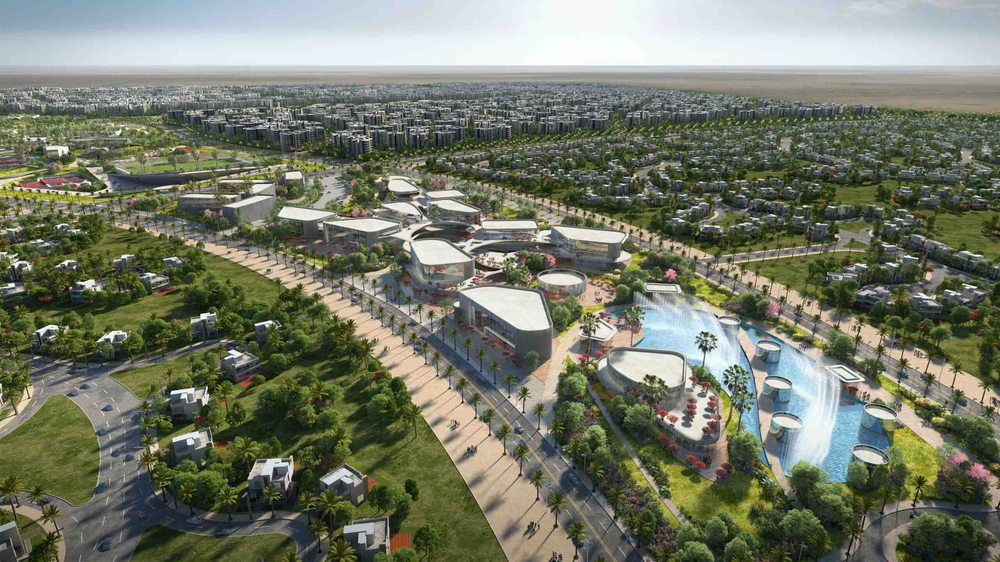

<div align="center">

# 🏙️ NOOR Capital Gardens
### Your New Address for Smart Living

**An interactive, ultra-modern Next.js enterprise landing page showcasing smart urban infrastructure, IoT in-unit intelligence, smart access control, and masterplan exploration with full bilingual support (English & Arabic).**

<br />

[](https://noor-smart-city.vercel.app/)
[](https://nextjs.org/)
[](https://react.dev/)
[](https://www.typescriptlang.org/)
[](https://tailwindcss.com/)

<br />

[🔗 **Explore Live Demo**](https://noor-smart-city.vercel.app/) · [🐞 Report Issue](https://github.com/saagy/Noor-landing-page/issues) · [💼 Connect on LinkedIn](https://www.linkedin.com/in/sagy-tamer/)

</div>

---

## 📸 Preview

<div align="center">
  
</div>

---

## ✨ Key Features

- 🎬 **Dynamic Hero Experience**: Scroll-synchronized video animations with smooth zoom-out transitions and high-performance perspective scaling.
- 🌐 **Comprehensive Bilingual & RTL Support**: Seamless real-time English & Arabic language switcher featuring authentic translations, bidirectional layout mirroring (LTR/RTL), and custom typography pairing (`Nexa` for English and `Bahij TheSansArabic` for Arabic).
- 🔑 **Smart Access Control Showcase**: Interactive feature demonstration for digital QR guest invitations, zero-lobby wait elevator dispatch, intercom access, and turnstile controls.
- 💡 **In-Unit Intelligence Matrix**: Interactive cards highlighting smart panels, automated routine scenes, energy tracking, and water/gas leakage safety sensors.
- 🗺️ **Interactive Masterplan**: District-level spatial explorer with interactive location pins, real-time feature highlights, and architectural floor plan previews.
- 📱 **Fully Responsive Architecture**: Pixel-perfect layout optimization across desktop, ultra-wide, tablet, and mobile viewport sizes.

---

## 💡 Engineering Highlights

- **Custom Zero-Dependency Localization**: Lightweight, state-driven bilingual engine (EN/AR) with automatic document direction (`dir="rtl"` / `dir="ltr"`) and font swapping without performance overhead or layout shifting.
- **60 FPS Smooth Scroll & Animations**: Integrated [Lenis](https://lenis.darkroom.engineering/) smooth scroll combined with hardware-accelerated [Framer Motion](https://www.framer.com/motion/) triggers.
- **Next.js 16 (App Router) & React 19**: Modern component architecture separating server/client concerns for optimal bundle size and first contentful paint (FCP).
- **Modern Styling**: Built using **Tailwind CSS v4** with CSS variables for dynamic theming and responsive grid systems.

---

## 🛠️ Tech Stack

| Category | Technologies |
| :--- | :--- |
| **Framework** | [Next.js 16](https://nextjs.org/) (App Router), [React 19](https://react.dev/) |
| **Language** | [TypeScript](https://www.typescriptlang.org/) (Strict Mode) |
| **Styling & UI** | [Tailwind CSS v4](https://tailwindcss.com/), PostCSS |
| **Motion & Scroll** | [Framer Motion](https://www.framer.com/), [Lenis](https://lenis.darkroom.engineering/) |
| **Icons & Media** | [Lucide React](https://lucide.dev/), Custom Arabic & English Webfonts |
| **Deployment** | [Vercel](https://vercel.com/) |

---

## 🚀 Getting Started

### Prerequisites

- **Node.js** (v18.x or higher)
- **npm** / **yarn** / **pnpm**

### Installation & Local Setup

1. **Clone the repository**:
   ```bash
   git clone https://github.com/saagy/Noor-landing-page.git
   ```

2. **Navigate into the application folder**:
   ```bash
   cd Noor-landing-page/noor-app
   ```

3. **Install dependencies**:
   ```bash
   npm install
   ```

4. **Run the development server**:
   ```bash
   npm run dev
   ```

5. Open [http://localhost:3000](http://localhost:3000) in your browser to view the application.

---

## 📦 Project Structure

```text
Noor-landing-page/
├── README.md               # Root documentation & recruiter showcase
└── noor-app/               # Next.js web application
    ├── app/                # App Router pages, layout, and global styles
    ├── components/         # Modular React UI components (Hero, Masterplan, Access, etc.)
    ├── lib/                # Bilingual dictionary & translation utilities
    ├── public/             # Static assets (images, videos, custom fonts)
    ├── package.json        # Project metadata and dependencies
    └── tsconfig.json       # TypeScript configuration
```

---

## 🏗️ Production Build

To test or generate a production build locally:

```bash
cd noor-app
npm run build
npm run start
```

---

## 👤 Author

**Sagy Tamer**

- 🚀 **Live Demo**: [noor-smart-city.vercel.app](https://noor-smart-city.vercel.app/)
- 💼 **LinkedIn**: [linkedin.com/in/sagy-tamer](https://www.linkedin.com/in/sagy-tamer/)
- 🐙 **GitHub**: [@saagy](https://github.com/saagy)
- 📧 **Email**: [sagyelmoghazy1@gmail.com](mailto:sagyelmoghazy1@gmail.com)

---

<div align="center">
  <sub>Built with ❤️ by Sagy Tamer. Feel free to reach out for collaboration or opportunities!</sub>
</div>
